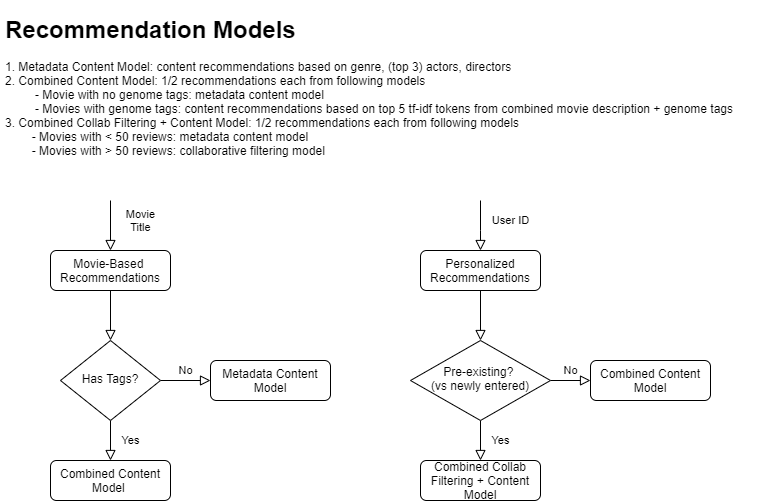
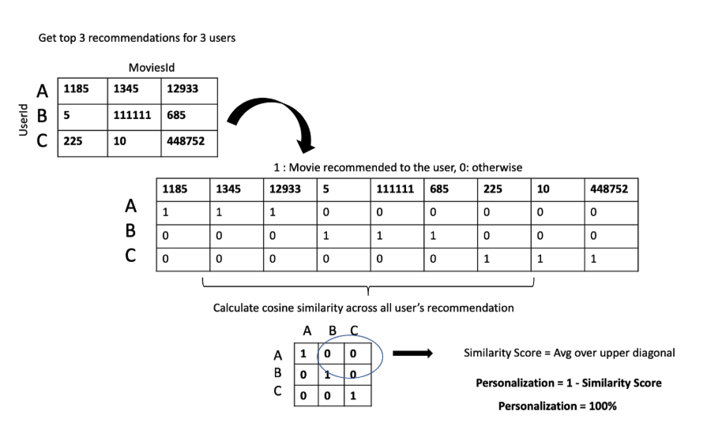
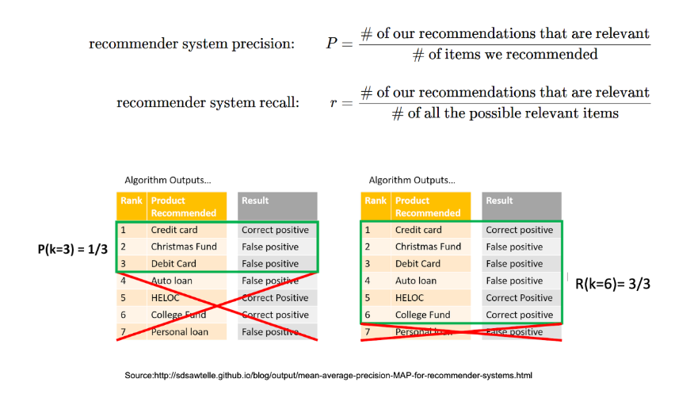
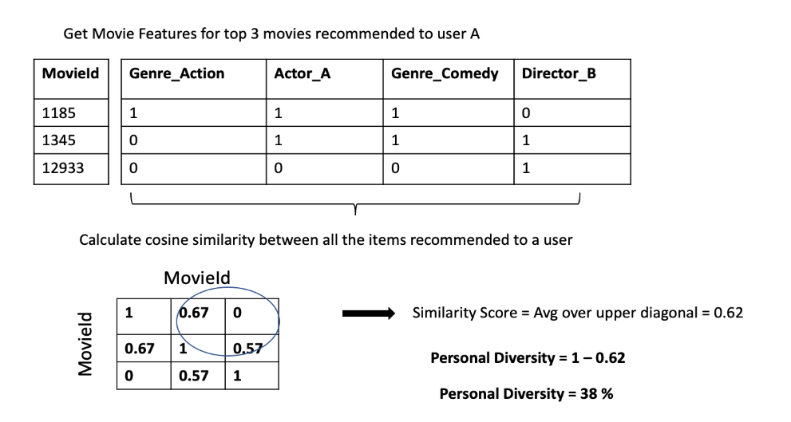
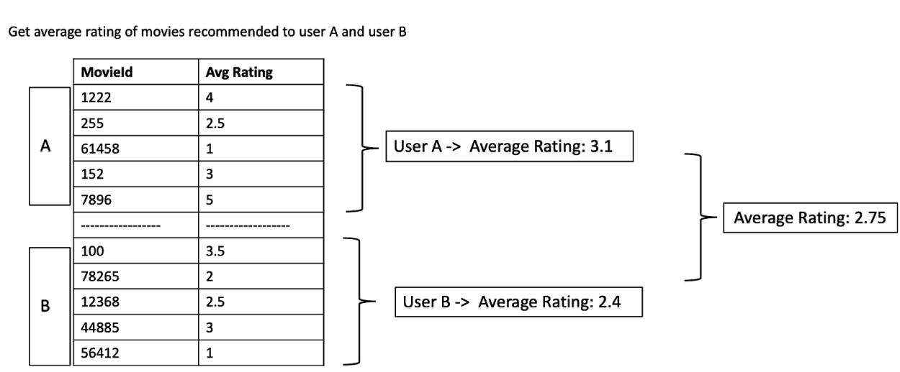
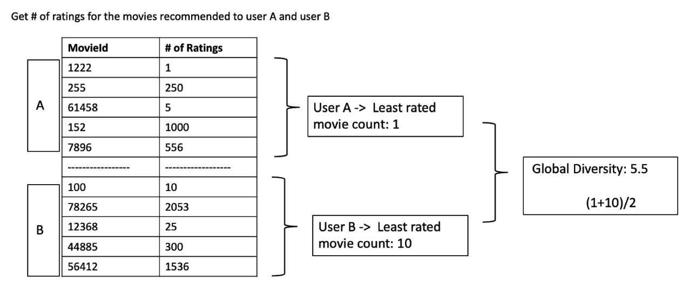

# DS5500-Movie-Recommendation-System

  * [Data](#data)
  * [UI Overview](#ui-overview)
  * [Models Overview](#models-overview)
    + [Evaluation Metrics](#evaluation-metrics)
    + [Content-Based Models](#content-based-models)
    + [Collaborative Filtering Models](#collaborative-filtering-models)
    + [Final Models](#final-models)
    + [Re-training](#re-training)
    + [Summary of the Model Flow](#summary-of-the-model-flow)
  * [Repo Structure](#repo-structure)
  * [How To Host App in AWS](#how-to-host-app-in-aws)
  * [Project Learnings](#project-learnings)
- [Methodological Appendix](#methodological-appendix)
  * [Evaluation Metrics](#evaluation-metrics-1)
    + [Personalization](#personalization)
    + [Precision, Recall @ K](#precision-recall--k)
    + [Personal Diversity](#personal-diversity)
    + [Average Rating](#average-rating)
    + [Global Diversity](#global-diversity)
  * [Model Methodology, Iteration & Performance](#model-methodology-iteration--performance)
    + [1. Content-Based Models](#1-content-based-models)
    + [2. Combined Content-Based Models](#2-combined-content-based-models)
    + [3. Collaborative Filtering Models](#3-collaborative-filtering-models)
    + [4. Combined Content and Collaborative Filtering Models](#4-combined-content-and-collaborative-filtering-models)

This project creates a movie recommendation system with a Streamlit UI to provide multiple types of users with tailored recommendations. Our ultimate goal is to increase viewership on a movie streaming platform and thus use these recommendations to help with the paradox of choice and to present new, "long tail" movies to users. Thus, we imagine this product being integrated into an existing streaming platform to utilize the platform's movie catalog and user's preferences through both explicit ratings and implicit clicks/views. To proxy this environment, we use the MovieLens dataset of user explicit ratings paired with IMDB movie metadata. The streamlit experience is intended to proxy a single login session in which users can view multiple types of recommendations and create their own personal profile if they do not have a pre-existing profile of rated movies. 

__Link to application:__ http://18.221.135.100:8501

## Data 
This project utilizes two public datasets. 

1. __MovieLens__: movie rating data collected from the MovieLens application created by the GroupLens Research lab at the University of Minnesota. MovieLens provides non-commercial, personalized recommendations to users for free. We are using the 25 Million dataset, which includes ~58,000 movies with ratings from ~28M users. Ratings are from 0.5 to 5 stars with 0.5 increment. Each user gives a minimum of 20 ratings. GroupLens also produces genome tags using a machine learning algorithm based on user inputted tags, ratings, and text reviews. Each movie is given a relevance score (0-1) for each tag.             
Dataset: https://grouplens.org/datasets/movielens/            
MovieLens Website: https://movielens.org/          

2. __IMDb movies extensive dataset__: Scraped data from the IMDB website including release year, genre, duration, director(s), actors, production company, language, country, and description (and more).          
Dataset (Kaggle): https://www.kaggle.com/stefanoleone992/imdb-extensive-dataset            

We merge these two datasets on each movie's IDMB ID, which is provided in both datasets. We drop about 17,000 movies in this merge as the IMDB set does not include all of the movies in the MovieLens set. 
 
As described in the modeling section, some of our models are content-based and thus depend on this movie metadata. We ultimately one-hot-encode all of the features used to build the models, but first perform the following feature engineering.
- Both MovieLens and IMDB include, sometimes non-matching, genre lists. We take the union of both lists for each movie. 
- Limit the actors lists to the 3 top actors in each movie. We cannot reasonably one-hot-encode all actors for all movies due to memory and performance limitations. Additionally, minor actors likely do not affect a user's movie preference. 
  - Top actors are determined by the number of movies in the catalog they have appeared in 
- Find top 5 TF-IDF scoring tokens for a variety of text fields: MovieLens genome tags, movie description, and combined tags + description field 
  - First clean these fields: downcase, remove non-ASCII, remove punctuation, tokenize, remove stop words (leave in some key negation words), and lemmatize
- Drop all categorical values that appear in only one movie. For example, actors in only one movie. These are not helpful for finding similar movies and increase memory, performance needs

## UI Overview
Our UI is built on Streamlit (https://www.streamlit.io/)     
Link to UI: http://18.221.135.100:8501      
         
It consists of 5 pages:
1. __Top Movie Visualizations__: View visualizations of the movies in our catalog to understand what makes a great movie
 - Subset of visualizations created in exploratory data analysis. Focus on visualizations that would be informative to a user understanding how to choose a good movie to watch
2. __Top Rated Movies__: Apply filters to find the top rated movies with your desired attributes
 - Provide non-model based recommendations to non-users.
 - Movies are sorted on the weighted average between their average rating and total number of ratings. If we sort on average rating only, there are many movies that are rated only a few times and thus have unrealistically high average ratings 
3. __Movie Based Recommendations__: Enter a movie that you have previously enjoyed to view similar movies
 - Item-Item recommendation model. Find movies similar to the inputted movie based on its content profile
4. __Personalized Recommendations__: Enter your user ID to find your personalized top movies + apply filters
 - Generates personalized recommendations based on the specific user. Uses a combination of user-user collaborative filtering and a content-based model
 - User can filter down top recommendations 
5. __Add Profile__: If you are not in our system, create a new profile to enable personalized recommendations
 - Generates a unique user ID
 - User can enter movies and ratings to generate a new profile that can then be entered into the Personalized Recommendations tab
 - Profiles can be returned to and expanded during the session. Can only make one unique profile per session to simulate the log-in experience. 
 - Profiles are saved such that they can be accessed in subsequent sessions

## Models Overview

### Evaluation Metrics
These metrics are discussed in depth in the Methodological Appendix. At a high level, we want recommendations with the following attributes:
- Personalized recommendations: provide materially different sets of recommendations for different users
- Accurate recommendations: high precision and recall based on test/train split of user ratings
- Personal diversity: provide variety of recommendations to each individual user
- Average rating: recommend high quality movies with high average ratings
- Global diversity: recommend movies in the long tail.
    - Do not only recommend popular movies because this will not increase overall viewership, engagement with the streaming platform 

To achieve all of these goals, we use combinations/ensembles of several models to produce recommendations.      
At the highest level, there is a trade-off between content based models and collaborative filtering models.          
             
### Content-Based Models
Recommend movies with similar meta-data attributes to movies that the target user has rated highly              
Pros:
  - Global diversity: no cold start problem - can recommend new and unpopular movies 
  - Personalization: recommendations are not biased towards a smaller subset of popular movies. Content models will recommend a wide variety of movies, thus increasingly the likelihood of generating different recommendations for different users    
              
Cons:
  - Personal diversity: over-specialization when defining a user's profile such that they are recommended a narrow set of very similar movies
  - Accurate rating: it is very difficult to achieve good precision and recall because we are generating predictions for all of the ~45,000 movies in the catalog and then recommending 10. It is unlikely that the user has rated those 10 movies in the test set. But this does not mean the recommendations are bad.             
             
### Collaborative Filtering Models
Recommend movies that were rated highly by users that have a similar rating history to the target user                
Pros:
  - Average rating: biased towards popular movies which means both frequently watched and highly rated movies
  - Accurate recommendations: users are more likely to rate popular movies and collaborative filtering models are more likely to recommend popular movies. Thus more likely than content-based to get a match between train and test set.         
            
Cons: 
  - Personalization: biased towards a smaller subset of popular movies, so hard to generate different recommendations for different users
  - Global diversity: biased towards popular movies that have been watched many times. Most implementations explicitly exclude movies with small numbers of ratings. 
  - Need for re-training: The model needs to be retrained periodically to reflect new users ratings. Cannot produce collaborative recommendations for newly inputted profiles. 
  
### Final Models
Our __final personalized model__ uses a combination of collaborative filtering and content-based approaches. For movies with more than 50 ratings, we use a KNN user-user collaborative filtering method to find similar users. For all other movies, we use a content-based approach that finds similar movies based on their genres, actors, and directors. For the final recommendation list, we take the top 5 movies from each system and present a list of 10 movies sorted by the weighted average between the movie's number of ratings and average rating. We thus achieve all of our goals by both recommending movies that we are confident the user will like via collaborative filtering and movies in the long tail via content- based. We sort on weighted average because we want to present the most popular movies first in order to gain the user's trust, and then present the less popular "long-tail" movies that they likely have not heard of in hopes of increasing our platform's overall number of streams.   

Our app also provides movie based recommendations where the user inputs a movie and we recommend similar movies. The __final item-item model__ uses a purely content-based approach because we do not have user rating data in this instance. The final content model is a combination of two models that use two different content profiles. For movies with genome tags (about 25% of movies), we find similar movies based on their top 5 TF-IDF tokens from a combined text field of genome tags plus movie description. For movies without genome tags (about 75% of movies), we find similar movies based on their genres, actors, and directors. For the final recommendation list, we take the top 5 movies from each system and, again, present a list of 10 movies sorted by the rating weighted average. Movies with tags are generally more popular with more ratings than movies without tags. The recommendations based on tags have better precision and recall than recommendations based on genre, actors, and directors, but they fail to reach the long tail. Thus, similar to the personalized model, we present a mix of confident recommendations and long-tail recommendations.

There are several caveats to these two final models in how they are used in the Streamlit app: 
1. If a user enters a new profile in the app during a session (or entered a profile in a prior session that hasn't been part of a retrain yet), we generate personalized recommendations using the combined content-only based approach that we use for item-item where we find similarity between the user's profile and every movie's profile. The collaborative filtering model is precomputed and requires training to generate recommendations, but the content model meanwhile generates recommendations on demand. The new profile is saved and will be included in periodic collaborative retraining such that those recommendations would be available in the future. 
2. If the movie entered on the 'Movie Based Recommendations' page does not have any genome tags, our recommendations will only be based on genres, actors, and directors. We cannot use tags to recommend if the reference movie does not have tags. 
3. While collaborative filtering is designed to produce predictions for movies with more than 50 ratings, we were unable to train this model on our full user base due to processing limitations and thus not all movies with more than 50 ratings are given predictions. Instead, only movies with more than 50 ratings that have been viewed by at least one of the 5000 users that we trained collaborative filtering on are included. Thus we actually use the content-based model for all movies that are not in the collaborative filtering set, some of which have more than 50 ratings. 
    - The Streamlit app only includes a further subset of these 5000 users to 1000 users in its pre-loaded set of users for the personalized model. Because we are using free-tier AWS EC2 to host the app, we have a maximum of 1GB of memory. It does also include users who manually entered profiles in prior runs of the app but have not yet been part of a retrain where we generate collaborative recommendations for them. They can still get personalized content based recommendations. 

### Re-training
- Re-train collaborative filtering periodically to incorporate new ratings, movies, and users. This includes getting recommendations for the new manually added profiles
- Content-based models do not require re-training because they generate recommendations on demand. The only requirement is that the source data is updated to include new movies, ratings, and users. 
- For use in production, we should define thresholds for the various evaluation metrics to evaluate and prevent model drift. For example, we deem the model to be underperforming if the personalization metric falls below some amount. 

### Summary of the Model Flow
These flow diagrams represent the two model based pages in the UI.



## Repo Structure
Folders:  
- evaluations: text files with model evaluation results
- images: PNG images used in ReadMe
- pages: script modules for each page of streamlit UI (ipynb for development, py versions for modules)
    - home_page: initial home page with instructions
    - EDA_Streamlit_page: Top Movie Visualizations
    - non_user_recommendations: Top Rated Movies
    - item_item_rec_app: Movie Based Recommendations
    - personalized_rec_app: Personalized Recommendations
    - profile_add_app: Add Profile
    - Images_rec folder: PNG images for EDA_Streamlit_page
- recommendation_models: script modules for each recommendation model (ipynb for development, py versions for modules)
    - content_based_recommendations: content model
    - content_based_recommendations_combine: combine two content models
    - collab_recommendations: collaborative model based on pre computed recommendations formed in Collaborative_Filtering_Recommendation_Model
    - collab_content_recommendations_combine: combine collaborative and content models
- processed_files: processed data files 
    - This repo does not include all of the raw and processed data used in the project due to their large size and git size limitations. Raw data can be downloaded from the data links given above and processed data can be recreated by running scripts. 
    
Scripts (ipynb):
- Collaborative_Filtering_Recommendation_Model: train collaborative filtering model(s) 
- EvaluationFunction: evaluate recommendation model iterations with 5 metrics previously described
- main_app: main streamlit UI function that calls in functions in pages folder for individual pages
- recommendation data exploration: pre-processing and feature engineering of raw movie and ratings data
- recommendation_data_display: prepare movie data for display on streamlit UI. Also limit ratings data to users with collaborative filtering recommendations for use in the app. 
- movies_EDA: exploratory analysis of movies and rating data. Creates visualizations shown on Top Movie Visualizations page of UI 

Requirements:
- requirements.txt: all required packages and versions to run project including all analysis 
- requirements-app.txt: all required packages and versions to run streamlit app

## How to Host App in AWS
We host our Streamlit app using AWS EC2. These instructions are specific to using Free Tier AWS. 

1. Sign up with your email ID and set up the payment information on the AWS website. Works just like a simple sign-on.
2. Go to AWS Management Console using https://us-west-2.console.aws.amazon.com/console.
3. In the first step, you need to choose the AMI template for the machine. I select the 18.04 Ubuntu Server since it is applicable for the Free Tier. And Ubuntu.
4. In the second step, select the t2.micro instance as again it is the one which is eligible for the free tier. As you can see t2.micro is just a single CPU instance with 1GB RAM.
5. Keep pressing Next until you reach the “6. Configure Security Group” tab. You will need to add a rule with Type: “Custom TCP Rule”, Port Range:8501, and Source: Anywhere. We use the port 8501 here since it is the custom port used by Streamlit.
6. You can click on “Review and Launch” and finally on the “Launch” button to launch the instance. Once you click on Launch you would need to create a new key pair and download that using the “Download Key Pair” button. Keep this key safe as it would be required every time you need to login or copy files onto this particular machine. Click on “Launch Instance” after downloading the key pair. Make sure you have the keypair stored as a ‘pem’ file. You might need to convert provided ppk to pem using following steps:
```
$ brew install putty             
$ puttygen key.ppk -O private-openssh -o key.pem
```
7. You can now go to your instances to see if your instance has started. Select your instance and copy the Public DNS(IPv4) Address from the description. It should be something starting with ec2.
8. Once you have that run the following commands in the folder you saved the key.pem file or you can give the relative path below.:
```
chmod 400 key.pem                      
ssh -I “key.pem” ubuntu@<Your Public DNS(Ipv4) Address>
```
9. Install miniconda, create new environment and activate the newly created environment:
```
sudo apt-get update

wget https://repo.continuum.io/miniconda/Miniconda3-latest-Linux-x86_64.sh -O ~/miniconda.sh

bash ~/miniconda.sh -b -p ~/miniconda

echo "PATH=$PATH:$HOME/miniconda/bin" >> ~/.bashrc

source ~/.bashrc

conda create --name myNewEnv python=3.5

source activate myNewEnv
```
10. Move your code from your local to the EC2 instance- either using git or scp. If any of your files are greater than 100MB then you would need to use GIT LFS. LFS encoding and decoding was causing issues in our app so we ended up using scp:
```
scp -i key.pem -r /source/path ubuntu@<Your Public DNS(Ipv4) Address>:/destination/path
```
11. Execute in your environment:
```pip install -r requirements.txt```

12. Navigate to your app’s location and execute
```streamlit run yourApp.py &```

The above “&” is used so the process runs in the background and you can safely ‘exit’ from the instance and the app would continue to run.

## Project Learnings
- We initially expected to build one personalized model, but found that ensembles can help optimize for competing trade-offs. Thus we were able to optimize both global diversity and precision, recall. 
- We initially imagined a simpler UI with two pages: Top Rated Movies and Personalized Recommendations. But we thought about the different use cases and decided to also build a Movie Based Recommender to give users without ratings some sense of personalized recommendations. We also expanded our design to allow users to manually enter profiles. 
- To build the UI, we learned about Streamlit in python to create a multi-page application and learned how to host the application with AWS EC2.

# Methodological Appendix

## Evaluation Metrics 
- For all metrics, they are calculated on a random subset of users and we report the average value taken across those users. For personalization, take average across K sets (folds) of random users because comparing users to each other rather than calculating for individual users. 
- Make sure to set the seed such that different models are evaluated on the same random subsets
- Results from all models are recorded in 'evaluations' folder as text files 

### Personalization
- _Goal_: Maximize differences between movie recommendations for different people
- _Method_: K fold cross-validation across several sets of users


### Precision, Recall @ K
- _Goal_: Maximize "accuracy" of model i.e. ability to retrieve recommendations that user's actually like
- _Method_: 
  - Select random users who have rated at least 20 movies so that there enough movies to do a reasonable train/test split
  - Split data into train/test sets by selecting random users and then for each user, splitting their ratings half into test and half into train. 
  - Generate recommendations based on training data. See if recommend any movies from the test data that the user actually liked ("relevant movies")
       - For content models and combined collaborative-content models, a movie is considered a relevant movie with rating >= 2. This is a low threshold because it is very difficult, as discussed in the next bullet, to retrieve user rated movies using content models, so we want to be generous in the definition. 
       - For collaborative filtering models, a movie is considered a relevant movie with rating >= 4. The precision and recall stats are much higher for these models and thus we can be more restrictive in our definition. 
  - Ideally would have real time user feedback for the recommendations we produce to assess accuracy. Test/train split is a proxy in lieu of that data. It is very difficult, especially for content based recommendation systems, to achieve good precision and recall because we are generating predictions for all of the ~45,000 movies in the catalog and then only recommending 10. It is unlikely that the user has rated those 10 movies in the test set. This does not mean the recommendations are bad. 
  
  


### Personal Diversity 
- _Goal_: For individual users, maximize the variety of movies that are recommended
  - Content models tend to create overspecialization where users are only presented with one type of movie. Thus need to evaluate the degree of this problem. 
  - Filtering function in UI also helps deal with this problem as users can view specific types of recommendations   
- _Method_:
  - Find cosine similarity between recommended movies' content profiles for a particular user
  - Movie features depend on the model being evaluated (if tags model, look at diversity of tags. If genre, actors, and directors model, then look at diversity of genres, actors, and directors)


### Average Rating
- _Goal_: Recommend "good" movies with high average ratings. Recommendation system is not specifically designed for this, but good to track across systems   
- _Method_: 
    - Find the average rating for the recommended movies


### Global Diversity
- _Goal_: Recommend some "unpopular" movies such that users view movies in the long tail that they otherwise would not be exposed to. Thus increase overall viewership. 
- _Method_: Minimize this metric 
    - Find the minimum number of ratings for the recommended movies


## Model Methodology, Iteration & Performance 

We went through several stages of model building with many iterations in each stage. The iterations are as follows:
1. __Content-based models__
2. __Combined content-based models__ where some subset of movies are predicted using one content model and the rest of the movies are predicted with a different content model
3. __Collaborative filtering models__
4. __Combined content and collaborative filtering models__ where some subset of movies are predicted using the collaborative filtering model and the rest of the movies are predicted with a content model    
         
Next, we go through each of the stages to describe both the methodology used and the iterations attempted. We present numbers for each evaluation metric and describe the best model chosen for each stage. All of these evaluations can be found in the 'evaluations' folder as text files. Bolded model names are summarized in tables. You may also look into the evaluation files for the non-bolded models, as they are listed as a sub-bullet under each model.

### 1. Content-Based Models

__Methodology__
1. Create movie profiles: one-hot-encodings of content features
2. Normalize ratings: subtract user’s mean ratings from each rating 
    - < 0: below average rating, > 0: above average rating
3. Create user profile: sum of (normalized) ratings for each feature
4. Find cosine similarity between user profile and every movie profile
    - Only normalize user profile, NOT movie profile. Using movie normalization penalizes movies with more information. For example, some movies do not have any actors or directors vectors because we excluded actors/directors only in 1 movie. If we normalized movies, we would promote movies without actors/directors because their vectors are shorter. 
5. Remove movies already watched/rated and movies with negative predicted ratings from recommendations
6. Remove movies if predicted that the user will not like the movie aka cosine similarity less than 0. 
    - None of these would appear in the top 10 recommendations, but if the user applies restrictive filters in the UI, then we do not want to display these recommendations.
7. Sort first on similarity score (prediction) and secondarily on movie's rating weighted average if same prediction
     
__Iterations & Performance__     
Iterate on which movie features to use to create the movie and user profiles.        
- __Baseline__: genre, (top 3) actors, director 
     - contentv2_noMovieNorm_eval.txt
- __All meta-data__: genre, actor, director, decade, country, production company 
     - content_all_meta_eval.txt
- Individual features: try each individual feature in "all meta-data"
     - content_(feature name)_eval.txt
- Baseline + Production Company: (country and decade performed poorly individually, so try adding just production company to baseline)
     - content_baseline_plus_prod_eval.txt
- __Description TFIDF__: top 5 TF-IDF tokens from movie description
     - content_desc_eval.txt
- Description TFIDF + Genre: top 5 TF-IDF tokens from movie description + genres 
     - content_desc_genre_eval.txt 
- __Tags TFIDF__: top 5 TF-IDF genome tags
     - content_tags_eval.txt
- __Tags Relevant__:  top 5 genome tags by relevance score
     - content_tags_rel_eval.txt
- __Tags Relevant + Baseline__: top 5 tags by relevance + baseline features (actors, directors, genres)
     - content_baseline_tags_rel_eval.txt 
- __Text TFIDF__: top 5 TF-IDF text field (tags + description)
     - content_text_eval.txt

| Model | Personalization | Precision@10 | Recall@10 | Personal diversity | Global diversity | Average rating
| --- | --- | --- | --- | --- | --- | --- 
| Baseline | 0.99 | 0.02 | 0.007 | 0.52 | 6.4 | 3.2
| All meta-data | 0.99 | 0.02 | 0.006 | 0.42 | 1.05 | 3
| Description TFIDF | 0.99 | 0 | 0 | 0.62 | 1.1 | 3.1
| Tags TFIDF | 0.96 | 0.075 | 0.02 | 0.36 | 415 | 3.8
| Tags Relevant | 0.98 | 0.06 | 0.02 | 0.60 | 524 | 3.5
| Tags Relevant + Baseline | 0.99 | 0.045 | 0.02 | 0.64 | 116 | 3.4
| Text TFIDF | 0.96 | 0.085 | 0.02 | 0.32 | 647 | 3.8

- Out of the non-text/TFIDF related models, the baseline performs the best across almost all metrics (except global diversity, but still very low number at 6.4). This implies that country, decade, and production company are not significantly important in forming an opinion about a movie as adding them worsened performance. The main benefit of adding actors and directors in addition to genres is that they provide differentiation to create more specific recommendations. In other words, if we form recommendations purely on genre, then all movies with the same genre list will have the same predicted similarity.     
- For the text based models, it is unclear which model performs the best, but it is clear both that global diversity suffers and that these models perform better in precision and recall than the non-text models.           
     - We first considered the description field because every movie has a description, but those tokens perform poorly with precision and recall of zero. 
     - Using genome tags provides a performance boost, but causes severe degradation in global diversity. This is because ~75% of movies don't have tags and tagged movies are heavily biased towards "popular" movies with many ratings. 
     - Thus we combined tags with other metadata to increase coverage. We tried both baseline features (genres, actors, directors) and TFIDF based on a combined tags and description text field. Neither of these models significantly improved in global diversity. However, the TFIDF text model does perform best for precision and average rating, although its personal diversity score is lower than some other text based models. 

__Conclusion/Next Steps__: using genome tags significantly improves performance but results in poor global diversity. Thus try using two separate models: one for movies with tags and one for movies without tags. Combine recommendations from each model such that we provide both recommendations we are confident in that are recognizable movies and recommendations in the long tail that may increase overall streaming. We suspect that tags perform well because they capture the most important information from other meta-data -- they include information like actors, genres, and plot themes.
    
### 2. Combined Content-Based Models

__Methodology__     
1. Fit two content models:                 
    (1) Model based on meta-data out of movies without genome tags             
    (2) Model based on genome text features out of movies with genome tags              
- In both cases, generate predicted similarities for all movies and then limit to respective set of movies. Thus forming user profile based on all movies they have watched
2. If producing N recommendations, choose top N/2 recommendations from model 1 and top N/2 recommendations from model 2
3. Sort combined list of N recommendations on movie's rating weighted average, thereby producing the most recognizable/"credible" results first to gain the user's trust before presenting the long-tail recommendations 

__Iterations & Performance__

Two sections:              
(1) Evaluate models on relevant movies (movies with tags vs movies without tags)       
(2) Evaluate combined models on full set of movies           
For movies without tags, we are using the baseline model (genre, actors, directors) as it was the best performing. For movies with tags, it was not clear which model was best so we iterate with all 3 of Tags TFIDF, Tags Relevant, and Text TFIDF.    

(1) Evaluate models on relevant movies
- __Relevant Tags Only__: top 5 genome tags by relevance score ONLY with movies that have tags
    - content_tags_rel_only_eval.txt
- __TFIDF Tags Only__:  top 5 genome tags by TFIDF ONLY with movies that have tags
    - content_tags_only_eval.txt
- __TFIDF Text Tags Only__:  top 5 tags+description fields by TFIDF ONLY with movies that have tags
    - content_text_tagsonly_eval.txt
- __Baseline no tags__: baseline model (genre, actor, director) ONLY for movies without tags 
     - content_baseline_notags_eval.txt
     
| Model | Personalization | Precision@10 | Recall@10 | Personal diversity | Global diversity | Average rating
| --- | --- | --- | --- | --- | --- | --- 
| Relevant Tags Only | 0.98 | 0.03 | 0.007 | 0.59 | 356 | 3.5
| TFIDF Tags Only | 0.96 | 0.07 | 0.008 | 0.36 | 910 | 3.8
| TFIDF Text Tags Only | 0.95 | 0.075 | 0.02 | 0.31 | 688 | 3.8
| Baseline no tags | 0.99 | 0.01 | 0.005 | 0.49 | 1.2 | 3.0
     
(2) Evaluate combined models on full set of movies
- __Combined Relevant__: combination of __Baseline no tags__ and __TFIDF Tags Only__ 
     - content_twomodels_tags_rel_eval.txt
- __Combined TFIDF__: combination of __Baseline no tags__ and __TFIDF Tags Only__
    - content_twomodels_tags_eval.txt
- __Combined Text__: combination of __Baseline no tags__ and __TFIDF Text Only__ 
    - content_twomodels_text_eval.txt

| Model | Personalization | Precision@10 | Recall@10 | Personal diversity | Global diversity | Average rating
| --- | --- | --- | --- | --- | --- | --- 
| Combined Relevant | 0.99 | 0.025 | 0.01 | 0.67 | 1.85 | 3.25
| Combined TFIDF | 0.99 | 0.045 | 0.01 | 0.70 | 1.85 | 3.39
| Combined Text | 0.98 | 0.055 | 0.015 | 0.69 | 1.85 | 3.42

__Conclusions__       
- Baseline performs slightly worse in precision and recall on movies with no tags compared to the full set of movies. This is unsurprising because the long tail movies are less likely to be viewed and thus less likely to be in a user's test set for precision and recall 
- Text based models on only movie with tags perform similarly to when evaluated on the full set of movies, which makes sense as the full data effectively ignored movies without tags for these models. 
- The combined models evaluated on all movies perform in between the two individual models, which is logical. They also have higher personal diversity as we are using a larger, more diverse set of movies. The combined models all perform better than any individual model on all movies as they balance all metrics with middling precision and recall, but good reach of the long tail (global diversity).
- The best combined model is Combined Text in terms of precision, recall, and average rating. All of its other stats are almost identical with the other models. 

__Best Content Model:__ Combined Text
- Recommendations for movies without tags: genre, actors, directors
- Recommendations for movies with tags: top 5 TFIDF tokens from combined genome tags + description text field 

### 3. Collaborative Filtering Models

Collaborative filtering is a type of recommendation system that uses both user and item data. Here items are recommended based on the ratings from other users.           
There are two types of collaborative recommendation systems:

1) Memory based: calculates the similarity between users/items ratings pairs. 
- Example: Nearest Neighbor approach

2) Model Based: reduces the dimension of the user-item matrix.
- Example: SVD

__Methodology__     

1. Exclude movies with fewer than 50 ratings
2. Build train dataset using of a subset of 5000 users. Training the model on complete dataset was not feasible due to computational limitations.
3. Fit  the model on the train dataset.
4. Build test data set: create all the user-item combinations not present in the train dataset
5. Predict ratings on the test dataset
6. Remove movies if predicted that the user will not like the movie aka predicted rating less than the user's personal average movie rating 
    - None of these would appear in the top 10 recommendations, but if the user applies restrictive filters in the UI, then we do not want to display these recommendations.
7. Sort first on predicted rating and secondarily on movie's rating weighted average if same prediction
   
We mainly consider two main collaborative filtering models (this decision is detailed in the next section). We thus describe the prediction methodology for each in more depth:    
         
_SVDpp_:        
In the context of the recommender system, SVD is used as a collaborative filtering technique. It uses a matrix structure where each row represents a user and each column represents an item. The elements of this matrix are the ratings that are given to items by users.
It involves factorizing a sparse matrix and finding two latent factor matrices: the first is the user matrix to indicate the user’s features (i.e., the degree of preference of a user for each factor) and the other is the item matrix, which indicates the item’s features (i.e., the weight of an item for each factor). The missing ratings are then predicted from the inner product of these two factor matrices. SVD++  is a model that achieves better accuracy by adding implicit feedback such as movies that a user has evaluated, wish list, clickthrough rate etc.

_KNNBaseline_:               
This is a simple memory based collaborative filtering model where it finds similar users based on common ratings, and make predictions using the average rating of top-k nearest neighbors.

Similarity calculation methods with KNNBaseline():

1) Mean Square Difference: Mean square difference between all pairs of the users. This method often results in overfitting where most of the predicted ratings are high. 

2) Pearson Baseline: Compute the Pearson coefficient between all pairs of users. Additional baseline estimates are taken into consideration when predicting ratings.                   
Ex: want to predict the rating of the movie A by user 1. Now, lets say the average rating over all movies, μ, is 3.7 stars and movie A is better than an average movie, so it tends to be rated 0.5 stars above the average. On the other hand, user 1 is a critical user and tends to rate 0.3 stars lower than the average. Thus, the predicted rating for  movie A  by user 1 would be 3.9 stars by calculating 3.7 − 0.3 + 0.5. This to an extent solves the overfitting issue.
    
__Iterations & Performance__

For collaborative filtering, we are using Surprise Library for recommendation system by python. We compared all of the available memory based and model based collaborative filtering models.

The top 5 models with lowest RMSE score:
- Used 1000 users to compare all the models
- Cross validation  = 5

| Algorithm | test_rmse | 
| --- | ----------- | 
| SVDpp | 0.8708| 
| KNNBaseline | 0.8780 |
| BaselineOnly | 0.8788 |
| SVD | 0.870 | 0.8848 |  
| KNNWithZScore | 0.8937 | 

The top two models with lowest rmse were selected for Baseline model selection.

1) SVDpp() : A model based recommendation system.
	- Evaluation_collaborative_filtering_model_svdpp.txt
2) KNNBaseline() : A memory based recommendation system.	                               
	- a) Using Mean Squared Difference similarity between all pairs of users (or items)
		- collaborative_with_sim_msd.txt
	- b) Using Pearson correlation coefficient between all pairs of users (or items) using baselines for centering instead of means
		- collaborative_with_sim_pearson_baseline.txt 

| Model | Personalization | Precision@10 | Recall@10 | Personal diversity | Global diversity | Average rating
| --- | --- | --- | --- | --- | --- | --- 
| SVDpp | 0.79 | 0.87 | 0.26 | 0.36 | 1495.15 | 4.07
| KNNBaseline | 0.80 | 0.84 | 0.27 | 0.42 | 86.2 | 3.6
| KNNBaseline with Pearson | 0.96 | 0.81 | 0.29 | 0.41 | 110.1 | 3.53

__Conclusions__       

1) We selected KNNBaseline as our baseline model because the overall performance in terms of both evaluation metrics and execution time was better than SVDpp(). 
2) The baseline model with Mean Squared Difference similarity was overfitting and was predicting good ratings for most of the test data. To overcome the overfitting problem, we used KNNBaseline with Pearson correlation similarity.           
           
__Best Collaborative Filtering Model:__ KNN Baseline with Pearson        
                     
### 4. Combined Content and Collaborative Filtering Models

__Methodology__        
1. Fit collaborative filtering model for movies with more than 50 ratings
    - Only train collaborative filtering for a subset of 5000 users due to processing limitations. Thus not all movies with more than 50 ratings are included. Instead, only movies with more than 50 ratings that have been viewed by at least one of the 5000 users are included.
2. Fit content model for movies with fewer than 50 ratings (+ all other movies not included in collaborative filtering)
3. If producing N recommendations, choose top N/2 recommendations from collaborative filtering model and top N/2 recommendations from content-based model
4. Sort combined list of N recommendations on movie's rating weighted average, thereby producing the most recognizable/"credible" results first to gain the user's trust before presenting the long-tail recommendations 

__Iterations & Performance__         
               
Two sections:              
(1) Which content model to use for movies not included in collaborative filtering          
(2) Combined content and collaborative filtering model           

(1) Which content model       
- __Baseline__:  genre, (top 3) actors, director for movies not in collaborative filtering
     - content_baseline_nocollab_eval.txt
- __Combined Text__: best content model for movies not in collaborative filtering
     - content_combined_tags_nocollab_eval.txt   
        
| Model | Personalization | Precision@10 | Recall@10 | Personal diversity | Global diversity | Average rating
| --- | --- | --- | --- | --- | --- | --- 
| Baseline | 0.99 | 0.005 | 0.0003 | 0.30 | 1.3 | 2.9 
| Combined Text | 0.87 | 0.01 | 0.001 | 0.53 | 1.85 | 3.16

(2) Combined content and collaborative filtering model
- __KNN + Baseline__: Combining best collaborative filtering and best content based model (see conclusions section for why baseline was selected for content model)
     - collab_content_combine_5000users.txt

| Model | Personalization | Precision@10 | Recall@10 | Personal diversity | Global diversity | Average rating
| --- | --- | --- | --- | --- | --- | --- 
| KNN + Baseline | 0.91 | 0.50 | 0.17 | 0.40 | 1.85| 3.01 

__Conclusions__       
- We are using the baseline content model because while the combined text performs better along some metrics, the text TFIDF section of the combined model is given access to a very small number of movies. There are few movies with tags that are not included in collaborative filtering. You can see this in the lower personalization score since recommendations are selected from a much smaller movie set for each user, making overlap more common. 
- The combined collaborative-content model performs far better than the best content model in terms of precision and recall, while still reaching the long tail effectively. It performs slightly worse in personalization, but user recommendations are still 90% different. Additionally, personal diversity is worse than some other models at 40%. This is counterintuitive to our assumption that content models perform worse for personal diversity due to over-specialization. Regardless, our UI provides a workaround for poor personal diversity by allowing users to provide filters to see different types of recommendations, so we are willing to make this trade-off in favor of precision and recall.

__Best Overall Personalization Model:__ KNN + Baseline
- Recommendations for movies with fewer than 50 ratings: content based on genre, actors, directors            
- Recommendations for movies with more than 50 ratings: KNN Baseline with Pearson collaborative filtering   
